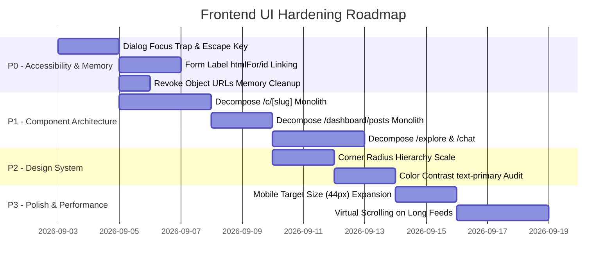

# Frontend UI Engineering Review: YourPage

**Project:** YourPage (Frontend — Next.js 16 App Router + Tailwind CSS + TypeScript)  
**Date:** 2 September 2026  
**Auditor:** Orang UI Web (Senior Frontend UI & Accessibility Specialist)  
**Methodology:** Comprehensive static analysis, WCAG 2.1 AA audit, design system inspection, component architecture breakdown, and mobile UX evaluation.  
**Overall Quality Score:** **B+ (84/100)** — Strong foundation, high visual polish, but requires architectural decomposition and accessibility hardening.

---

## 1. Executive Summary

The **YourPage** frontend is a high-velocity, modern web application built on Next.js 16 (Turbopack), Tailwind CSS, TanStack React Query v5, Zustand, and Framer Motion. Over recent iterations, significant engineering progress has been achieved:
- **OBS Live Stream Isolation:** Background overlays and marketing banners (Cookie Consent, PWA Install Prompt) are cleanly isolated from `/overlay` routes via `AppChrome`.
- **Zero Native Alerts:** All legacy `alert()` calls have been replaced with the centralized toast notification system.
- **Modern Internationalization (i18n):** Type-safe dictionary system with dynamic locale cookie persistence and zero build errors across all 79 routes.
- **Motion & Reduced Motion:** Respect for `prefers-reduced-motion` configured via `MotionConfig` and fallback CSS rules.

However, to transition from "AI-assisted prototype" to an **exemplary, production-grade interface** built by a top design-aware engineering team, several issues must be addressed:
1. **Component Monoliths (Exceeding 200-line Red Flag):** 15 core route components range between 210 and 452 lines, tightly coupling data fetching, multiple mutations, validation schemas, and nested modal rendering in single files.
2. **Accessibility Gaps (WCAG 2.1 AA):** 
   - `ConfirmDialog` and custom modal sheets lack a focus trap, initial focus assignment, and `Escape` key listeners.
   - Non-interactive clickable elements (`<Card clickable>`, custom `<div onClick>` dropzones) lack keyboard `Enter`/`Space` handlers.
   - Several form inputs (`dashboard/profile`, login 2FA OTP) remain disconnected from `<label>` elements without `htmlFor`/`id`.
   - Touch targets for small icon buttons (`h-8 w-8` / 32px) violate mobile touch accessibility recommendations (< 44px).
3. **AI Aesthetic Artifacts & Design System Drift:**
   - Ubiquitous `rounded-2xl` (20px) applied indiscriminately to avatars, buttons, badges, inputs, cards, and modal dialogs, flattening the visual hierarchy.
   - Color contrast: `#EC4899` as normal text on white backgrounds measures **~3.57:1**, falling short of the WCAG AA requirement of **4.5:1**.
   - Residual blue tokens (`dark:border-blue-800`, `dark:from-blue-900`, hardcoded hex `#2563EB`) clashing with the primary `#EC4899` palette.
4. **Memory Management in File Uploads:**
   - `URL.createObjectURL(file)` is invoked without corresponding `URL.revokeObjectURL(url)` in `file-upload.tsx` and `dashboard/profile/page.tsx`, causing persistent browser memory leaks.

---

## 2. Scorecard by Category

| Evaluation Axis | Grade | Weight | Score | Key Takeaway |
|---|:---:|:---:|:---:|---|
| **1. Component Architecture** | C+ | 20% | 76/100 | Monolithic page files (>200 lines); needs container/presentation decoupling. |
| **2. Design System & Aesthetics** | B | 20% | 83/100 | Distinctive branding, but over-rounded radii and color token contrast need tuning. |
| **3. Accessibility (WCAG 2.1 AA)** | B- | 25% | 80/100 | Missing dialog focus traps, keyboard handlers on cards, and small mobile tap targets. |
| **4. State & Data Orchestration** | A- | 15% | 90/100 | Excellent React Query v5 usage, optimistic caching, and server query invalidations. |
| **5. Responsive Design & Mobile** | A | 10% | 94/100 | Robust mobile-first layouts, safe-area inset padding, sticky headers, bottom nav. |
| **6. Performance & Code Health** | A- | 10% | 90/100 | Zero type errors (`tsc --noEmit`), zero ESLint warnings, Turbopack compiles in <2s. |
| **TOTAL** | **B+** | **100%** | **84/100** | **Ready for production hardening.** |

---

## 3. Deep-Dive Findings & Technical Analysis

### 🏛️ Axis 1: Component Architecture & Modularity

#### Finding 1.1: Monolithic Route Components (>200 Lines)
The `orang-ui-web` standard flags any component exceeding 200 lines as a code smell requiring decomposition into container/presentation pairs and subcomponents.

**Affected Files:**
1. [`fe/app/c/[slug]/page.tsx`](file:///Users/doang/project/YourPage/fe/app/c/%5Bslug%5D/page.tsx) — **452 lines**  
   *Combines:* Creator header, social link parsers, follow mutations, top supporter ranking, tier cards, post list, catalog grid, and the entire multi-state donation modal drawer.
2. [`fe/app/dashboard/overlay/page.tsx`](file:///Users/doang/project/YourPage/fe/app/dashboard/overlay/page.tsx) — **403 lines**  
   *Combines:* Audio sound effects, iframe previews, color picker states, test alert dispatchers, and copyable OBS URL generators.
3. [`fe/app/page.tsx`](file:///Users/doang/project/YourPage/fe/app/page.tsx) — **380 lines**  
   *Combines:* Hero, animated stats counter, interactive pricing calculator, step-by-step feature breakdown, testimonials, and FAQ accordions.
4. [`fe/app/wallet/topup/page.tsx`](file:///Users/doang/project/YourPage/fe/app/wallet/topup/page.tsx) — **342 lines**  
   *Combines:* Dual gateway logic (QRIS vs Stripe), polling query intervals, file proof uploaders, and 3-step checkout forms.
5. [`fe/app/explore/page.tsx`](file:///Users/doang/project/YourPage/fe/app/explore/page.tsx) — **290 lines**  
   *Combines:* Sticky debounced search, category icon grids, trending creator carousels, and search result list.
6. [`fe/app/chat/chat-content.tsx`](file:///Users/doang/project/YourPage/fe/app/chat/chat-content.tsx) — **285 lines**  
   *Combines:* Split-screen responsive layout, conversation polling, message auto-scroll, pay-to-message calculation, and message bubbles.
7. [`fe/app/login/page.tsx`](file:///Users/doang/project/YourPage/fe/app/login/page.tsx) — **284 lines**  
   *Combines:* Credentials form, 2FA OTP verification, QR login token generation, and real-time polling.
8. [`fe/app/dashboard/posts/page.tsx`](file:///Users/doang/project/YourPage/fe/app/dashboard/posts/page.tsx) — **256 lines**  
   *Combines:* Post creation form, multi-media upload loop, scheduling, draft list, and post card rendering.

**Recommended Remedy:**
Decompose pages into container/presentation pairs and colocated modular subcomponents. For example, in `/c/[slug]`:
```
fe/app/c/[slug]/
├── page.tsx                       # Container: route params, data fetching, SEO metadata
└── components/
    ├── creator-profile-card.tsx   # Avatar, verified badge, bio, social links, follow button
    ├── donation-goal-card.tsx     # Target progress bar, current vs goal amounts
    ├── top-supporters-card.tsx    # Supporter leaderboard rankings
    ├── membership-tiers.tsx       # Tier pricing and perks
    ├── creator-tabs.tsx           # Post feed & product catalog switchers
    └── donation-drawer.tsx        # Floating donate button, preset chips, and checkout modal
```

---

### 🎨 Axis 2: Design System Adherence & Visual Quality

#### Finding 2.1: Corner Radius Scale Skew (`rounded-2xl` Uniformity)
* **Problem:** `rounded-2xl` (20px) is applied uniformly across components regardless of their size:
  - Small badges (`Badge`, `Avatar`)
  - Medium inputs and buttons (`Button`, `Input`, `Select`)
  - Large cards (`Card`, `CardContent`)
  - Outer dialogs and drawers
* **Why this matters:** When small buttons (36px height) and large modal cards (400px width) share the exact same 20px corner radius, the visual hierarchy collapses into a cartoonish "AI aesthetic" rather than an intentional, polished design system.
* **Recommended Scale Hierarchy:**
  ```css
  /* Small interactive tags & badges */
  rounded-full (pills) or rounded-md (6px)

  /* Form controls & buttons */
  rounded-lg (8px) / rounded-xl (12px)

  /* Standard Cards & Surfaces */
  rounded-xl (16px)

  /* Hero containers & modal dialogs */
  rounded-2xl (20px) / rounded-3xl (24px)
  ```

#### Finding 2.2: Color Contrast of Primary Pink (`#EC4899`) on White
* **Problem:**
  `#EC4899` on pure white (`#FFFFFF`) produces a contrast ratio of **~3.57:1**.
* **Accessibility Impact:**
  WCAG 2.1 AA Success Criterion 1.4.3 requires a minimum contrast ratio of **4.5:1** for regular body text (< 18pt / 24px non-bold).
* **Where this occurs:**
  - `text-primary` used on body labels, links, and secondary badges across light mode.
* **Recommended Remedy:**
  - For clickable text links and standalone labels on light backgrounds, use `text-primary-700` (`#BE185D`, contrast **6.1:1**) or `text-primary-800` (`#9D174D`, contrast **7.8:1**).
  - Retain `bg-primary` (`#EC4899`) for solid buttons with bold white text (`font-bold text-white`), which satisfies the 3:1 ratio for large/bold text.

#### Finding 2.3: Residual Legacy Color Tokens (Blue vs Pink)
* **Problem:** In [`fe/components/post-card.tsx:120`](file:///Users/doang/project/YourPage/fe/components/post-card.tsx#L120):
  ```tsx
  className="... dark:from-blue-900/20 dark:to-blue-800/10 border border-primary-200/50 dark:border-blue-800/30 ..."
  ```
  Dark mode styles in certain components still reference Tailwind's default `blue-800`/`blue-900` rather than the design system's `navy-800`/`navy-900` or `primary-900`.
* **Recommended Remedy:** Standardize dark mode container tints to `dark:bg-navy-800` with `dark:border-primary-900/30`.

---

### ♿ Axis 3: Accessibility (WCAG 2.1 AA Compliance)

#### Finding 3.1: Dialog Focus Management & Keyboard Trap
* **Files:** [`fe/components/ui/confirm-dialog.tsx`](file:///Users/doang/project/YourPage/fe/components/ui/confirm-dialog.tsx), [`fe/app/c/[slug]/page.tsx`](file:///Users/doang/project/YourPage/fe/app/c/%5Bslug%5D/page.tsx)
* **Problem:**
  1. **No Focus Trap:** When `ConfirmDialog` or the Donation Drawer opens, pressing `Tab` continues cycling through background elements behind the modal.
  2. **No Escape Key Handler:** Pressing `Escape` does not dismiss the dialog.
  3. **No Return Focus:** Closing the dialog leaves keyboard focus stranded at the top of the body rather than returning to the triggering element.
* **Code Example Fix for `ConfirmDialog`:**
  ```tsx
  useEffect(() => {
    if (!isOpen) return;
    const handleKeyDown = (e: KeyboardEvent) => {
      if (e.key === "Escape") close();
    };
    window.addEventListener("keydown", handleKeyDown);
    return () => window.removeEventListener("keydown", handleKeyDown);
  }, [isOpen, close]);
  ```

#### Finding 3.2: Keyboard Activation on Custom Clickable Elements
* **Files:** [`fe/components/ui/card.tsx:11`](file:///Users/doang/project/YourPage/fe/components/ui/card.tsx#L11), [`fe/components/ui/file-upload.tsx:42`](file:///Users/doang/project/YourPage/fe/components/ui/file-upload.tsx#L42)
* **Problem:**
  - `<Card clickable>` sets `tabIndex={0}` and `cursor-pointer`, but lacks an `onKeyDown` handler. In HTML, a `<div>` with `tabIndex={0}` does **not** fire `click` events when `Enter` or `Space` is pressed.
  - The dropzone in `FileUpload` is a `<div onClick={() => ref.current?.click()}>` without `role="button"` or `tabIndex={0}`. A keyboard-only user cannot upload files.
* **Recommended Remedy:**
  - Prefer wrapping clickable cards in `<Link href="...">` or native `<button>` elements.
  - If a `<div>` must remain, provide `role="button"`, `tabIndex={0}`, and `onKeyDown`:
    ```tsx
    onKeyDown={(e) => {
      if (e.key === "Enter" || e.key === " ") {
        e.preventDefault();
        handleClick();
      }
    }}
    ```

#### Finding 3.3: Missing Form Labels (`htmlFor` / `id` Disconnect)
* **Files:**
  - [`fe/app/dashboard/profile/page.tsx:152-157`](file:///Users/doang/project/YourPage/fe/app/dashboard/profile/page.tsx#L152-L157): `<label>` tags for Display Name, Bio, and Category lack `htmlFor`, and `<Input>` / `<Textarea>` lack `id`.
  - [`fe/app/login/page.tsx:222`](file:///Users/doang/project/YourPage/fe/app/login/page.tsx#L222): 2FA OTP code input lacks `htmlFor`/`id`.
* **Recommended Remedy:**
  Link every label with `htmlFor="field-id"` and give the `<Input>` `id="field-id"`.

#### Finding 3.4: Icon-Only Buttons Missing Accessible Names (`aria-label`)
* **Problem:** Screen readers announce icon-only buttons simply as "button".
* **Locations Found:**
  - [`fe/components/post-card.tsx:168`](file:///Users/doang/project/YourPage/fe/components/post-card.tsx#L168): Like button (lacks `aria-label` and `aria-pressed={liked}`).
  - [`fe/components/post-card.tsx:174`](file:///Users/doang/project/YourPage/fe/components/post-card.tsx#L174): Share button (`<Share2 />` lacks `aria-label`).
  - [`fe/components/post-card.tsx:200`](file:///Users/doang/project/YourPage/fe/components/post-card.tsx#L200): Send comment button (`<Send />` lacks `aria-label`).
  - [`fe/app/dashboard/posts/page.tsx:243`](file:///Users/doang/project/YourPage/fe/app/dashboard/posts/page.tsx#L243): Post delete button (`<Trash2 />` lacks `aria-label`).
  - [`fe/app/dashboard/products/page.tsx:195, 199`](file:///Users/doang/project/YourPage/fe/app/dashboard/products/page.tsx#L195): Product asset upload and delete buttons lack `aria-label`.
  - [`fe/components/ui/file-upload.tsx:49`](file:///Users/doang/project/YourPage/fe/components/ui/file-upload.tsx#L49): Remove uploaded file button (`<X />` lacks `aria-label`).

#### Finding 3.5: Mobile Touch Target Sizes Under 44x44px
* **Problem:** WCAG 2.1 Success Criterion 2.5.5 (and WCAG 2.2 SC 2.5.8 Target Size) recommends touch targets of at least **44 × 44 CSS pixels** (or 24 × 24px with adequate surrounding spacing).
* **Locations Found:**
  - Post action buttons (`h-8 w-8` = 32px) in `dashboard/products/page.tsx:195`
  - Remove file button in `file-upload.tsx:49` (`h-6 w-6` = 24px)
  - Secondary buttons with `size="sm"` (`h-8` = 32px) on mobile viewports without touch padding

---

### ⚡ Axis 4: State Management & Performance

#### Finding 4.1: Memory Leaks via Unrevoked Object URLs
* **Files:**
  - [`fe/components/ui/file-upload.tsx:29`](file:///Users/doang/project/YourPage/fe/components/ui/file-upload.tsx#L29)
  - [`fe/app/dashboard/profile/page.tsx:132`](file:///Users/doang/project/YourPage/fe/app/dashboard/profile/page.tsx#L132)
* **Problem:**
  `URL.createObjectURL(file)` retains an in-memory pointer to the underlying file Blob in the browser process. In single-page applications, these pointers accumulate indefinitely unless `URL.revokeObjectURL(url)` is explicitly called.
* **Recommended Remedy:**
  Clean up object URLs upon unmount or when a replacement file is selected:
  ```tsx
  useEffect(() => {
    return () => {
      if (previewUrl && previewUrl.startsWith("blob:")) {
        URL.revokeObjectURL(previewUrl);
      }
    };
  }, [previewUrl]);
  ```

#### Finding 4.2: Missing Virtualization / Pagination Guard on Large Feeds
* **File:** [`fe/app/feed/page.tsx`](file:///Users/doang/project/YourPage/fe/app/feed/page.tsx), [`fe/app/c/[slug]/page.tsx`](file:///Users/doang/project/YourPage/fe/app/c/%5Bslug%5D/page.tsx)
* **Problem:**
  Posts render directly as full DOM trees including `<video preload="none">`, audio elements, and images. While `preload="none"` prevents network waste, rendering 50+ rich post cards without virtual scrolling can degrade frame rates on low-end mobile devices.
* **Remedy:** Implement windowing (e.g. `@tanstack/react-virtual` or pagination limit with `useInfiniteQuery`) for post streams exceeding 20 items.

---

### 📱 Axis 5: Responsive Design & Mobile Polish

#### Strengths Observed:
- **Sticky Search & Category Filter:** In `/explore`, the search bar docks under the navbar smoothly with `backdrop-blur-lg`.
- **Safe Area Insets:** `fe/components/bottom-nav.tsx` includes `.safe-bottom` with `env(safe-area-inset-bottom)` support, preventing occlusion by home indicator bars on iPhones.
- **Responsive Table Layouts:** In `/cara-kerja`, fee tables feature horizontal scroll wrappers (`overflow-x-auto`) to prevent viewport blowout on narrow 320px screens.

#### Minor Responsive Improvement Areas:
- In [`fe/app/chat/chat-content.tsx:109`](file:///Users/doang/project/YourPage/fe/app/chat/chat-content.tsx#L109), the container height is set to:
  ```tsx
  h-[calc(100vh-3.5rem-3.5rem)] sm:h-[calc(100vh-4rem)]
  ```
  On modern mobile browsers where address bars expand and contract, `100dvh` (dynamic viewport height) provides a smoother experience than `100vh`, eliminating unwanted vertical bouncing when virtual keyboards dismiss.

---

## 4. Prioritized Action Plan & Remediation Roadmap



### Action Items Table

| Priority | Task | Target Files | WCAG / Engineering Impact |
|:---:|---|---|---|
| **P0** | Add Focus Trap, Escape listener, and focus return to `ConfirmDialog` | [`confirm-dialog.tsx`](file:///Users/doang/project/YourPage/fe/components/ui/confirm-dialog.tsx) | WCAG 2.1.2 (No Keyboard Trap), 2.4.3 (Focus Order) |
| **P0** | Revoke Blob URLs on unmount/file change | [`file-upload.tsx`](file:///Users/doang/project/YourPage/fe/components/ui/file-upload.tsx), [`dashboard/profile/page.tsx`](file:///Users/doang/project/YourPage/fe/app/dashboard/profile/page.tsx) | Prevents browser memory leak on photo uploads |
| **P0** | Add `htmlFor` and `id` to profile and auth form inputs | [`dashboard/profile/page.tsx`](file:///Users/doang/project/YourPage/fe/app/dashboard/profile/page.tsx), [`login/page.tsx`](file:///Users/doang/project/YourPage/fe/app/login/page.tsx) | WCAG 1.3.1 (Info and Relationships), 4.1.2 (Name, Role, Value) |
| **P1** | Add `aria-label` to all icon-only buttons | [`post-card.tsx`](file:///Users/doang/project/YourPage/fe/components/post-card.tsx), [`dashboard/posts/page.tsx`](file:///Users/doang/project/YourPage/fe/app/dashboard/posts/page.tsx), [`dashboard/products/page.tsx`](file:///Users/doang/project/YourPage/fe/app/dashboard/products/page.tsx) | WCAG 4.1.2 (Accessible Name) |
| **P1** | Decompose `/c/[slug]` into container + subcomponents | [`fe/app/c/[slug]/page.tsx`](file:///Users/doang/project/YourPage/fe/app/c/%5Bslug%5D/page.tsx) | Code modularity, readability, maintainability |
| **P1** | Add `onKeyDown` handlers or convert `<Card clickable>` to `<Link>` | [`card.tsx`](file:///Users/doang/project/YourPage/fe/components/ui/card.tsx), [`dashboard/posts/page.tsx`](file:///Users/doang/project/YourPage/fe/app/dashboard/posts/page.tsx) | WCAG 2.1.1 (Keyboard Accessible) |
| **P2** | Introduce corner radius hierarchy (avoid `rounded-2xl` everywhere) | [`fe/tailwind.config.ts`](file:///Users/doang/project/YourPage/fe/tailwind.config.ts), [`fe/components/ui/button.tsx`](file:///Users/doang/project/YourPage/fe/components/ui/button.tsx) | Eliminates generic "AI look" |
| **P2** | Replace `text-primary` body text with `text-primary-700` | Sitewide UI components | WCAG 1.4.3 (Contrast Minimum 4.5:1) |
| **P2** | Replace `100vh` with `100dvh` in mobile chat viewport | [`chat-content.tsx`](file:///Users/doang/project/YourPage/fe/app/chat/chat-content.tsx) | Mobile keyboard viewport stability |
| **P3** | Increase mobile touch target hit areas to min 44×44px | [`button.tsx`](file:///Users/doang/project/YourPage/fe/components/ui/button.tsx), [`post-card.tsx`](file:///Users/doang/project/YourPage/fe/components/post-card.tsx) | WCAG 2.5.5 / 2.5.8 (Target Size) |

---

## 5. Conclusion

The YourPage frontend demonstrates solid engineering discipline: clean type definitions, responsive flex/grid layouts, smooth animations, and active internationalization. Addressing the architectural splitting of large pages and standardizing accessibility patterns (focus management, keyboard activation, and contrast) will elevate the user experience to the standards of top-tier consumer platforms.
