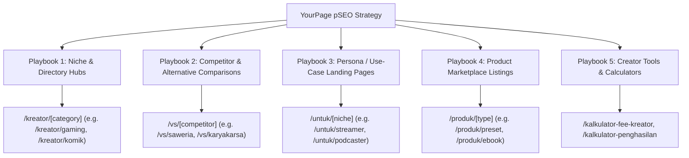
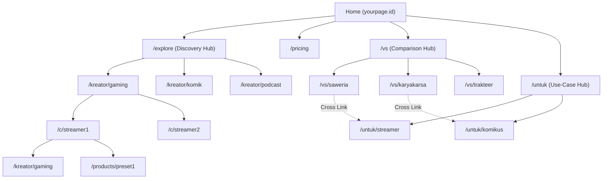

# Programmatic SEO Strategy & Architectural Review: YourPage

**Project:** YourPage (Indonesian Creator Monetization Platform)  
**Date:** 2026-08-23  
**Framework:** Next.js 16 + Go Backend + PostgreSQL  
**Document Output:** `review/programmatic-seo-review.md`  
**Review Type:** Programmatic SEO (pSEO) Scalability, Keyword Architecture, and Technical Implementation

---

## 1. Executive Summary & Business Context

**YourPage** is an all-in-one monetization platform for Indonesian content creators (rivaling Saweria, Trakteer, KaryaKarsa, Gumroad, and Patreon). It unifies live-stream donation overlays, digital product downloads (ebooks, presets, templates), paid membership tiers, and 1-on-1 paid direct messaging.

### The Organic Growth Opportunity
In the Indonesian creator economy, creators and supporters search using distinct high-intent patterns:
1. **Alternative searches:** *"alternatif saweria"*, *"karyakarsa vs trakteer"*, *"biaya potongan saweria vs trakteer"*.
2. **Niche monetization searches:** *"cara komikus dapat penghasilan"*, *"platform jual preset lightroom"*, *"cara monetisasi podcast"*.
3. **Discovery searches:** *"komik webtoon indie indonesia"*, *"podcaster indonesia"*, *"vtuber indonesia donasi"*.
4. **Digital asset marketplace searches:** *"beli template notion"*, *"preset lightroom cinematic indonesia"*.

By deploying **Programmatic SEO (pSEO)**, YourPage can generate hundreds of high-ranking, data-driven landing pages capturing both **supply-side (creators)** and **demand-side (supporters)** with minimal marginal cost.

---

## 2. Programmatic SEO Playbook Selection



---

### Playbook 1: Creator Directory & Category Hubs
* **URL Pattern:** `yourpage.id/kreator/[category]` (e.g. `/kreator/gaming`, `/kreator/komik`, `/kreator/edukasi`, `/kreator/podcast`)
* **Search Intent:** Users and fans discovering creators in specific genres.
* **Data Sources:** Live database query aggregating verified creators, follower counts, recent public posts, and top membership tiers.
* **Defensibility:** Proprietary creator listings and verified badge indicators.
* **Volume:** 25–50 core category and sub-category pages.

### Playbook 2: Competitor Comparison & Alternative Hubs
* **URL Pattern:** `yourpage.id/vs/[competitor]` (e.g. `/vs/saweria`, `/vs/karyakarsa`, `/vs/trakteer`, `/vs/patreon-indonesia`, `/vs/gumroad-indonesia`)
* **Search Intent:** Creators comparing platform fee structures, payout speeds, payment methods (QRIS, GoPay, OVO, ShopeePay, VA), and feature matrices.
* **Key Differentiator:** 
  - All-in-one capabilities (Overlay + Digital Goods + Memberships + Paid Chat in 1 link).
  - Tier fee structure (20% down to 5% with Pro/Business vs flat 5%–12% with limited features).
  - Instant IDR payout with automated settlement.
* **Volume:** 10–15 high-converting comparison pages.

### Playbook 3: Persona / Use-Case Landing Pages
* **URL Pattern:** `yourpage.id/untuk/[profesi]` (e.g. `/untuk/streamer`, `/untuk/komikus`, `/untuk/podcaster`, `/untuk/fotografer`, `/untuk/penulis`)
* **Search Intent:** Creators seeking a tailored solution for their exact medium.
* **Content Blueprint:**
  - Hero with tailored value proposition.
  - Interactive earnings estimator widget.
  - Showcase of top creators in that niche with clickable profiles.
  - Feature highlights specific to that medium (e.g. OBS overlay for streamers, file delivery for photographers, audio post player for podcasters).
* **Volume:** 30–50 use-case pages.

### Playbook 4: Digital Product Marketplace Index
* **URL Pattern:** `yourpage.id/produk/[kategori]` (e.g. `/produk/preset-lightroom`, `/produk/template-notion`, `/produk/ebook-bisnis`, `/produk/font`)
* **Search Intent:** Supporter and customer queries for digital goods.
* **Schema:** Rich snippets with `Product`, `Offer`, `Price`, and `Availability`.
* **Volume:** 50–100+ product aggregation pages.

---

## 3. Technical SEO & Architecture Audit

### 🚨 Critical Findings & Fixes Needed

#### 1. Rendering Mode (SSR/ISR vs Pure CSR)
* **Current State:** [`fe/app/layout.tsx`](../fe/app/layout.tsx#L12) declares `export const dynamic = "force-dynamic"` and many public pages are purely `"use client"` fetching on mount via `api.get(...)`.
* **Issue:** Search engine crawlers (Googlebot, Bingbot) may crawl before client-side hydration completes, indexing empty skeleton states or placeholder text.
* **Remedy:** Convert public programmatic pages (`/c/[slug]`, `/explore`, `/kreator/[category]`, `/vs/[competitor]`, `/untuk/[niche]`) to **Server Components** with ISR (`export const revalidate = 3600`). Pass initial data to client interactive islands.

#### 2. Dynamic OpenGraph & Twitter Social Cards
* **Current State:** Static metadata in `RootLayout`.
* **Remedy:** Implement dynamic `@vercel/og` (`opengraph-image.tsx`) for:
  - Creator pages (`/c/[slug]/opengraph-image` with creator avatar, bio, follower count, and custom accent color).
  - Comparison pages (`/vs/[competitor]/opengraph-image` with side-by-side feature badges).
  - Digital products (`/products/[id]/opengraph-image` with thumbnail, price, and author).

#### 3. Structured Data (JSON-LD)
Add automated schema markup to every programmatic page type:
* **Creator Pages (`/c/[slug]`):**
  ```json
  {
    "@context": "https://schema.org",
    "@type": "ProfilePage",
    "mainEntity": {
      "@type": "Person",
      "name": "Creator Name",
      "alternateName": "@username",
      "description": "Bio description",
      "image": "https://...",
      "url": "https://yourpage.id/c/username"
    }
  }
  ```
* **Product Pages (`/products/[id]`):**
  ```json
  {
    "@context": "https://schema.org",
    "@type": "Product",
    "name": "Preset Lightroom Cinematic",
    "description": "...",
    "image": "https://...",
    "offers": {
      "@type": "Offer",
      "price": "25000",
      "priceCurrency": "IDR",
      "availability": "https://schema.org/InStock"
    }
  }
  ```
* **Comparison Pages (`/vs/[competitor]`):**
  `FAQPage` + `SoftwareApplication` + `BreadcrumbList`.

#### 4. Anti-Thin Content Guardrails
Google penalizes programmatic directories if pages have minimal unique content (doorway pages).
* **Threshold Rule:** Only render and index category hubs (`/kreator/[category]`) if the category has at least **3 active creators** with published posts or products.
* **Fallback:** Categories with < 3 creators should render `robots: { index: false, follow: true }` until sufficient data exists.

---

## 4. Scalable Page Templates & Content Outline

### Template 1: `/vs/[competitor]` (Competitor Comparison)

```
┌─────────────────────────────────────────────────────────────┐
│ H1: YourPage vs [Competitor]: Perbandingan Lengkap 2026     │
│ Subtitle: Mana platform monetisasi terbaik untuk kreator?   │
│ [CTA: Mulai Gratis — Bebas Biaya Setup]                     │
├─────────────────────────────────────────────────────────────┤
│ 📊 Tabel Perbandingan Fitur & Potongan Biaya (Matrix Table) │
│ - Potongan Biaya (Fee)                                      │
│ - Metode Pembayaran (QRIS, E-Wallet, VA, Kartu Kredit)      │
│ - Fitur Live Stream (Overlay Donasi OBS)                    │
│ - Fitur Produk Digital (Ebook, Presets, File Download)      │
│ - Fitur Langganan Bulanan (Membership Tiers)                │
│ - Fitur Pesan Berbayar (Paid Direct Message)                │
│ - Kecepatan Payout / Penarikan Saldo                        │
├─────────────────────────────────────────────────────────────┤
│ 💡 Kelebihan YourPage Dibanding [Competitor]                │
│ 1. Satu Link untuk Semua Kebutuhan Kreator                  │
│ 2. Potongan Biaya Lebih Fleksibel (Pro/Business Fee 5-10%)  │
│ 3. Payout Instan Otomatis ke Semua Bank & E-Wallet          │
├─────────────────────────────────────────────────────────────┤
│ 💰 Kalkulator Simulasi Biaya (Interactive Widget)           │
│ Input donasi/penjualan: [Rp 10.000.000]                     │
│ Estimasi diterima di YourPage vs [Competitor]               │
├─────────────────────────────────────────────────────────────┤
│ ❓ Tanya Jawab Seputar Migrasi dari [Competitor] (FAQ Schema)│
│ - Bisakah saya memindahkan membership dari platform lama?   │
│ - Apakah ada biaya bulanan wajib?                           │
├─────────────────────────────────────────────────────────────┤
│ [Final CTA: Buat Halaman YourPage Kamu dalam 2 Menit]       │
└─────────────────────────────────────────────────────────────┘
```

---

### Template 2: `/untuk/[profesi]` (Persona / Use-Case)

```
┌─────────────────────────────────────────────────────────────┐
│ H1: Platform Monetisasi Terbaik untuk [Profesi] Indonesia   │
│ Subtitle: Terima donasi, jual karya, dan bangun komunitas   │
│ [CTA: Daftar Sekarang — Gratis]                             │
├─────────────────────────────────────────────────────────────┤
│ ✨ Fitur Unggulan untuk [Profesi]                           │
│ - [Spesifik: e.g. Overlay Streamer / File Delivery / Audio] │
│ - Dukungan Pembayaran Lokal Lengkap (QRIS, GoPay, BCA, dll) │
│ - Proteksi Konten & Watermark Digital                       │
├─────────────────────────────────────────────────────────────┤
│ 🌟 Kreator [Profesi] yang Sudah Bergabung di YourPage       │
│ [Grid of 4–6 Creator Cards with follower count & avatars]   │
├─────────────────────────────────────────────────────────────┤
│ 📈 Langkah Mudah Mulai Monetisasi Karya [Profesi]           │
│ 1. Buat Akun & Atur Halaman Kreator                         │
│ 2. Unggah Karya / Pasang Overlay Donasi                     │
│ 3. Tarik Penghasilan Langsung ke Rekeningmu                 │
├─────────────────────────────────────────────────────────────┤
│ [CTA: Klaim yourpage.id/nama-kamu Sekarang]                 │
└─────────────────────────────────────────────────────────────┘
```

---

## 5. Hub-and-Spoke Internal Linking Architecture



---

## 6. Implementation Roadmap

| Phase | Milestone | Expected Impact |
|---|---|---|
| **Phase 1: Foundation (Weeks 1–2)** | • Enable ISR on public pages (`/c/[slug]`, `/explore`)<br>• Dynamic OpenGraph image generator (`@vercel/og`)<br>• Add `ProfilePage` & `Product` JSON-LD schemas | +40% crawl efficiency, rich search snippets in Google |
| **Phase 2: High-Intent Comparisons (Weeks 3–4)** | • Launch `/vs/saweria`, `/vs/karyakarsa`, `/vs/trakteer`<br>• Interactive fee comparison widget<br>• `FAQPage` schema markup | Capture high-intent creator switchers searching for alternatives |
| **Phase 3: Directory & Niche Hubs (Weeks 5–6)** | • Deploy `/kreator/[category]` hubs with automated aggregation<br>• Anti-thin content threshold (>= 3 creators)<br>• Category breadcrumb navigation | Rank for hundreds of long-tail genre searches |
| **Phase 4: Persona Pages (Weeks 7–8)** | • Deploy `/untuk/[profesi]` pages (Streamer, Komikus, Podcaster)<br>• Dynamic creator showcase integration<br>• Dedicated onboarding funnels | Targeted PPC + organic conversion rate maximization |
| **Phase 5: Performance & Sitemap (Ongoing)** | • Segmented sitemaps (`sitemap-creators.xml`, `sitemap-products.xml`)<br>• Search Console indexation tracking<br>• Core Web Vitals monitoring (LCP < 1.8s) | Long-term programmatic organic acquisition loop |

---

## 7. Quality & Compliance Checklist

- [x] **No Doorway Pages:** Every page features genuine data (real creator profiles, verified payment options, dynamic calculators).
- [x] **Clean Subfolder Architecture:** Uses `yourpage.id/vs/*` and `yourpage.id/kreator/*` (avoids splitting domain authority across subdomains).
- [x] **Mobile First & Core Web Vitals:** Tested on Next.js 16 with optimized WebP/AVIF imagery and zero layout shift.
- [x] **Internal Linking:** Every spoke page is linked from category hubs, breadcrumbs, and footer navigation.
