# Implementation Plan: YourPage Platform

**Project:** YourPage (All-in-One Content Monetization Platform for Indonesian Creators)  
**Date:** 2026-08-24  
**Target Release:** Production v2.0  
**Task List Target:** [`tasks/todo.md`](./todo.md)

---

## 1. Executive Overview

**YourPage** is a full-stack platform empowering Indonesian creators to monetize digital goods, paid posts, memberships, live stream donation overlays (OBS), and 1-on-1 paid DM consultations with seamless national payment methods (QRIS, e-wallets, bank transfers).

This plan provides a prioritized, vertically-sliced roadmap to resolve all technical debt, establish enterprise-grade identity & authentication security (OAuth2 Google/Facebook, 2FA TOTP, Password History, Session Management, Magic Links), elevate UI accessibility to WCAG 2.1 AA, deploy high-converting programmatic SEO (pSEO), expand automated testing ($\ge 75\%$ backend coverage + Playwright E2E), and guarantee production readiness.

---

## 2. Architectural Decisions & Principles

### A. Financial Transaction Atomicity
- **Decision:** Wrap all multi-step balance mutations (wallet debit, purchase/payment records, creator credit addition, credit transaction audit logs) in explicit database transactions (`db.Transaction`) rather than relying on sequential queries with compensatory rollbacks.
- **Rationale:** Prevents race conditions, double-spending, and balance desynchronization under high concurrency. Enforces the database constraint `CHECK (balance_credits >= 0)`.

### B. Federated Identity & OAuth2 Account Linking
- **Decision:** Store external OAuth connections in a dedicated `user_oauth_accounts` table. Match existing accounts by verified primary email. Enforce state parameter nonces in Redis to prevent CSRF authentication hijacking.
- **Rationale:** Supports frictionless social logins (Google, Facebook, Apple) while preserving a single user identity and avoiding duplicate accounts.

### C. Multi-Factor & Account Defense in Depth
- **Decision:** Implement RFC 6238 TOTP 2FA with 8 single-use cryptographically hashed backup codes, enforce a 5-password history retention buffer (`password_histories`), and maintain active device/session state (`user_sessions`) with instant remote revocation capabilities.
- **Rationale:** Protects creator financial earnings, payout details, and supporter wallets from account takeover, credential stuffing, and unauthorized device access.

### D. Zero-Interference OBS Browser Source Architecture
- **Decision:** Completely isolate `/overlay` routes from global UI elements (cookie consent banners, PWA install popups, navbars, toast containers).
- **Rationale:** OBS browser sources must remain transparent and unobtrusive during live broadcasts.

### E. Server-First Programmatic SEO & Dynamic Metadata
- **Decision:** Implement programmatic SEO landing pages (`/vs/[competitor]`, `/kreator/[category]`, `/untuk/[niche]`) using Next.js Server Components with Incremental Static Regeneration (ISR, `revalidate = 3600`), dynamic `@vercel/og` image generation, and JSON-LD structured data.
- **Rationale:** Ensures optimal crawlability and indexability by search engines without client-side hydration delays.

### F. Dynamic Creator Storefront Theming (CSS Variables & Font Whitelisting)
- **Decision:** Store creator custom appearance (`page_color`, `font_style`, `custom_icon`, `card_style`, `custom_styles` JSONB) in PostgreSQL `creator_profiles` table. Inject styling into public storefront containers via scoped CSS Custom Properties (`--creator-accent`, `--creator-font`, `--creator-card-bg`) and whitelist safe Google Fonts (`Outfit`, `Rubik`, `Plus Jakarta Sans`, `Playfair Display`, `Space Grotesk`, `Inter`).
- **Rationale:** Prevents CSS injection / XSS vulnerabilities, eliminates heavy client-side style re-compilation, preserves Tailwind CSS purging optimizations, and delivers instant, zero-latency visual personalization for creators.

### G. Centralized Verification Badge System & Trust Architecture
- **Decision:** Establish a unified, accessible `<VerifiedBadge size="sm"|"md"|"lg" tooltip={true} />` component linked to `creator_profiles.is_verified` (and user verification status), rendered consistently across creator profiles, post feeds, comments, explore cards, direct messages, and admin consoles.
- **Rationale:** Standardizes identity trust signals sitewide, replaces fragmented ad-hoc icons, enforces WCAG 2.1 AA screen reader labeling, and empowers administrators to audit and toggle verification status with full accountability.

---

## 3. Phased Execution Roadmap

```mermaid
graph TD
    P1[Phase 1: Security, Financial Integrity & Core Backend] --> C1{Checkpoint 1: Core Integrity}
    C1 --> P2[Phase 2: Advanced Auth, OAuth & Identity Security]
    P2 --> C2{Checkpoint 2: Identity Security}
    C2 --> P3[Phase 3: Frontend UX, Accessibility & OBS Isolation]
    P3 --> C3{Checkpoint 3: Frontend Polish}
    C3 --> P4[Phase 4: Automated Testing & CI/CD Pipeline]
    P4 --> C4{Checkpoint 4: Quality Gates}
    C4 --> P5[Phase 5: Conversion Copywriting & Programmatic SEO]
    P5 --> C5{Checkpoint 5: Growth Engine}
    C5 --> P6[Phase 6: Creator Tools, Discovery & Engagement]
    P6 --> C6{Checkpoint 6: Engagement & Creator Hub}
    C6 --> P7[Phase 7: Production Hardening, Email & Launch]
    P7 --> C7{Checkpoint 7: Production Ready}
    C7 --> P8[Phase 8: User Profile Custom Styles & Verified Badge System]
    P8 --> C8{Checkpoint 8: Storefront Personalization & Trust Ready}
```

### Phase 1: Security, Financial Integrity & Core Backend
- [x] **Task 1:** Fix Members-Only Access Gating & Private Media Pre-signing ([`../be/internal/service/post.go`](../be/internal/service/post.go), [`../be/internal/pkg/storage/minio.go`](../be/internal/pkg/storage/minio.go))
- [x] **Task 2:** Database Transaction Atomicity for Wallet & Checkout ([`../be/internal/service/payment.go`](../be/internal/service/payment.go), [`../be/internal/service/chat.go`](../be/internal/service/chat.go))
- [x] **Task 3:** KYC Document Privacy & Admin Presigned View Endpoints ([`../be/internal/handler/kyc.go`](../be/internal/handler/kyc.go), [`../be/internal/service/admin.go`](../be/internal/service/admin.go))
- [x] **Task 4:** CreditTransaction Audit Ledger Completion for Chat & Referral Rewards ([`../be/internal/service/chat.go`](../be/internal/service/chat.go), [`../be/internal/service/auth.go`](../be/internal/service/auth.go))
- [x] **Task 5:** Schema Hygiene & Missing Composite Indexes Migration ([`../be/migrations/0048_schema_cleanup.sql`](../be/migrations/0048_schema_cleanup.sql))

### Phase 2: Advanced Authentication, OAuth & Identity Security
- [x] **Task 6:** OAuth2 Social Sign-In: Google & Facebook Login Integration ([`../be/internal/service/auth.go`](../be/internal/service/auth.go), [`../fe/app/login/page.tsx`](../fe/app/login/page.tsx))
- [x] **Task 7:** Password History & Security Policy Enforcement ([`../be/internal/service/auth.go`](../be/internal/service/auth.go), [`../fe/app/s/settings/page.tsx`](../fe/app/s/settings/page.tsx))
- [x] **Task 8:** Two-Factor Authentication (2FA / TOTP) with Emergency Backup Codes ([`../be/internal/service/auth.go`](../be/internal/service/auth.go), [`../fe/app/s/settings/page.tsx`](../fe/app/s/settings/page.tsx))
- [ ] **Task 9:** Active Device & Session Management with Remote Revocation ([`../be/internal/service/auth.go`](../be/internal/service/auth.go), [`../fe/app/s/settings/page.tsx`](../fe/app/s/settings/page.tsx))
- [x] **Task 10:** Magic Link Passwordless Sign-In & Suspicious Activity Alerts ([`../be/internal/service/auth.go`](../be/internal/service/auth.go), [`../fe/app/login/page.tsx`](../fe/app/login/page.tsx))

### Phase 3: Frontend UX, Accessibility & OBS Isolation
- [ ] **Task 11:** OBS Overlay Isolation & Global Popup Suppression ([`../fe/components/cookie-consent.tsx`](../fe/components/cookie-consent.tsx), [`../fe/components/install-prompt.tsx`](../fe/components/install-prompt.tsx))
- [ ] **Task 12:** WCAG 2.1 AA Accessibility Overhaul: Form Labels, Skip Links & Focus Rings ([`../fe/app/layout.tsx`](../fe/app/layout.tsx), [`../fe/app/login/page.tsx`](../fe/app/login/page.tsx))
- [ ] **Task 13:** SPA Navigation Polish: Replace `window.location.href` with Next.js `<Link>` ([`../fe/app/dashboard/posts/page.tsx`](../fe/app/dashboard/posts/page.tsx))
- [ ] **Task 14:** Memory Leak & Notification Hygiene: Revoke Blob URLs & Replace `alert()` ([`../fe/app/dashboard/analytics/page.tsx`](../fe/app/dashboard/analytics/page.tsx))
- [ ] **Task 15:** Resolve React 19 / Next.js ESLint Cascading Render Warnings ([`../fe/app/register/page.tsx`](../fe/app/register/page.tsx), [`../fe/components/navbar.tsx`](../fe/components/navbar.tsx))

### Phase 4: Automated Testing & CI/CD Pipeline
- [ ] **Task 16:** GitHub Actions CI/CD Automation (`.github/workflows/be-ci.yml`, `.github/workflows/fe-ci.yml`, `.github/workflows/deploy.yml`)
- [ ] **Task 17:** Backend Test Coverage Expansion: Auth, OAuth, 2FA, Admin, and Webhook Handlers (`be/internal/handler/*_test.go`)
- [ ] **Task 18:** Frontend E2E Testing Suite with Playwright (`fe/tests/e2e/auth.spec.ts`, `fe/tests/e2e/checkout.spec.ts`, `fe/tests/e2e/wallet.spec.ts`)
- [ ] **Task 19:** Automated Database Backup & Disaster Recovery Scripts (`scripts/backup-db.sh`, `scripts/restore-db.sh`)

### Phase 5: Conversion Copywriting & Programmatic SEO
- [ ] **Task 20:** Homepage & Landing Benefit-Driven Copy Overhaul ([`../fe/app/page.tsx`](../fe/app/page.tsx), [`../fe/components/navbar.tsx`](../fe/components/navbar.tsx))
- [ ] **Task 21:** Pricing, How-It-Works & Objection-Handling Copy Overhaul ([`../fe/app/pricing/page.tsx`](../fe/app/pricing/page.tsx), [`../fe/app/cara-kerja/page.tsx`](../fe/app/cara-kerja/page.tsx))
- [ ] **Task 22:** Auth, Registration & Onboarding Conversion Polish ([`../fe/app/register/page.tsx`](../fe/app/register/page.tsx), [`../fe/app/welcome/page.tsx`](../fe/app/welcome/page.tsx))
- [ ] **Task 23:** Programmatic SEO: Competitor Comparison Hubs ([`../fe/app/vs/[competitor]/page.tsx`](../fe/app/vs/[competitor]/page.tsx))
- [ ] **Task 24:** Programmatic SEO: Creator Category & Persona Hubs ([`../fe/app/kreator/[category]/page.tsx`](../fe/app/kreator/[category]/page.tsx))
- [ ] **Task 25:** Dynamic OpenGraph Social Previews & JSON-LD Structured Data ([`../fe/app/c/[slug]/opengraph-image.tsx`](../fe/app/c/[slug]/opengraph-image.tsx))

### Phase 6: Creator Tools, Discovery & Engagement (PRD Gaps)
- [ ] **Task 26:** Dynamic Watermarking for Protected Media & Digital Downloads ([`../be/internal/pkg/watermark/watermark.go`](../be/internal/pkg/watermark/watermark.go), [`../be/internal/service/post.go`](../be/internal/service/post.go))
- [ ] **Task 27:** Web Push Notifications (VAPID / Web Push API) ([`../be/internal/service/notification.go`](../be/internal/service/notification.go), [`../fe/public/sw.js`](../fe/public/sw.js))
- [ ] **Task 28:** Creator Storage Quota Enforcement & Upgrade Banners ([`../be/internal/handler/upload.go`](../be/internal/handler/upload.go), [`../fe/app/dashboard/profile/page.tsx`](../fe/app/dashboard/profile/page.tsx))
- [ ] **Task 29:** Creator Discovery Hub Overhaul (`/explore`) with Categories & Trending Filters ([`../be/internal/handler/public.go`](../be/internal/handler/public.go), [`../fe/app/explore/page.tsx`](../fe/app/explore/page.tsx))
- [ ] **Task 30:** Weekly Engagement Email Digests for Creators & Supporters ([`../be/internal/service/digest.go`](../be/internal/service/digest.go), [`../be/cmd/api/main.go`](../be/cmd/api/main.go))
- [ ] **Task 31:** First-Boot Admin Password Hardening & Forced Rotation Flow ([`../be/cmd/api/main.go`](../be/cmd/api/main.go), [`../be/internal/service/admin.go`](../be/internal/service/admin.go))

### Phase 7: Production Hardening, Email & Launch
- [ ] **Task 32:** Real SMTP Email Service Integration for Password Reset, Magic Links, Receipts & Alerts ([`../be/internal/pkg/mailer/mailer.go`](../be/internal/pkg/mailer/mailer.go))
- [ ] **Task 33:** Full-Stack APM & Observability Integration: OpenTelemetry, Prometheus & Grafana / SigNoz ([`../be/cmd/api/main.go`](../be/cmd/api/main.go), [`../fe/app/layout.tsx`](../fe/app/layout.tsx))
- [x] **Task 34:** Nginx SSL/TLS Hardening, Rate Limit Tuning & Production Launch Checklist ([`../nginx/nginx.production.conf`](../nginx/nginx.production.conf))

### Phase 8: User Profile Custom Styles & Verified Badge System
- [ ] **Task 35:** Database Schema & Migration for Custom Appearance & Verification Badges ([`../be/migrations/0063_creator_custom_styles_and_badges.sql`](../be/migrations/0063_creator_custom_styles_and_badges.sql), [`../be/internal/entity/user.go`](../be/internal/entity/user.go))
- [ ] **Task 36:** Backend API Endpoints for Custom Theming & Admin Verification Control ([`../be/internal/handler/auth.go`](../be/internal/handler/auth.go), [`../be/internal/handler/public.go`](../be/internal/handler/public.go), [`../be/internal/handler/admin.go`](../be/internal/handler/admin.go))
- [ ] **Task 37:** Reusable `<VerifiedBadge />` Component & Sitewide Trust Signaling Integration ([`../fe/components/ui/verified-badge.tsx`](../fe/components/ui/verified-badge.tsx), [`../fe/components/post-card.tsx`](../fe/components/post-card.tsx), [`../fe/app/c/[slug]/page.tsx`](../fe/app/c/[slug]/page.tsx))
- [ ] **Task 38:** Creator Dashboard Appearance Studio UI (Colors, Fonts, Custom Icons, Card Styles) ([`../fe/app/dashboard/profile/page.tsx`](../fe/app/dashboard/profile/page.tsx), [`../fe/components/profile/theme-customizer.tsx`](../fe/components/profile/theme-customizer.tsx))
- [ ] **Task 39:** Dynamic Theme Injection & Responsive Storefront Rendering Engine ([`../fe/app/c/[slug]/page.tsx`](../fe/app/c/[slug]/page.tsx), [`../fe/app/c/[slug]/components/creator-storefront-theme.tsx`](../fe/app/c/[slug]/components/creator-storefront-theme.tsx))
- [ ] **Task 40:** Automated E2E Testing, Contrast Accessibility & Verification Regression ([`../fe/e2e/creator-styling.spec.ts`](../fe/e2e/creator-styling.spec.ts), [`../be/internal/service/auth_test.go`](../be/internal/service/auth_test.go))

---

## 4. Risk Analysis & Mitigation Matrix

| Risk | Impact | Severity | Mitigation Strategy |
|---|---|---|---|
| **OAuth CSRF or Account Hijacking via Social Login** | Unauthorized account access | **HIGH** | Strict cryptographic state tokens validated against Redis with 5-minute TTL; require verified email match before automatic account linking. |
| **User Lockout due to Lost 2FA TOTP Authenticator** | Permanent account lockout | **HIGH** | Generate 8 single-use cryptographically hashed emergency recovery codes during 2FA enrollment; support admin identity recovery flow with KYC re-validation. |
| **Financial Race Condition during Top-up/Payout** | Double spending or negative balance | **HIGH** | Strict DB-level `CHECK (balance_credits >= 0)` constraint combined with `db.Transaction` and row-level locking (`SELECT ... FOR UPDATE`). |
| **Leak of KYC PII Documents (KTP/ID cards)** | Regulatory non-compliance (UU PDP) & privacy breach | **HIGH** | Strict private MinIO bucket segregation + admin-only short-lived pre-signed download URLs with audit logging. |
| **Low-Contrast Custom Page Colors Breaking WCAG Legibility** | Illegible text / poor user accessibility | **MEDIUM** | Frontend dynamic luminance calculation calculates whether custom accent requires `#FFFFFF` or `#0F0D1A` text contrast automatically. |
| **Malicious CSS / Font Injection via Custom Style Inputs** | Cross-Site Scripting (XSS) or visual spoofing | **HIGH** | Strict regex validation (`^#([A-Fa-f0-9]{6})$`) for hex colors; enforce rigid enum whitelist for fonts and icons; sanitize JSONB payload keys. |
| **OBS Overlay Visual Breakage During Live Streams** | Disrupted live stream production for creators | **MEDIUM** | Strict route guards suppressing cookie consent, modals, install prompts, and navigation on `/overlay` routes. |
| **Search Engine Penalization for Thin Programmatic Content** | Loss of organic search rank | **MEDIUM** | Anti-thin content guardrails: only index category pages with $\ge 3$ active creators; serve `noindex, follow` on sparse pages. |

---

## 5. Definition of Done (DoD)

A task is considered complete when:
1. All acceptance criteria listed in [`tasks/todo.md`](./todo.md) are met.
2. Backend tests pass: `cd be && go test -count=1 -v ./...`.
3. Frontend compiles and builds cleanly: `cd fe && npm run build`.
4. Linters report zero errors: `golangci-lint run` (backend) and `npm run lint` (frontend).
5. All database migrations execute cleanly on both `up` and `down` paths.
6. Documentation and code comments accurately reflect the implementation.
